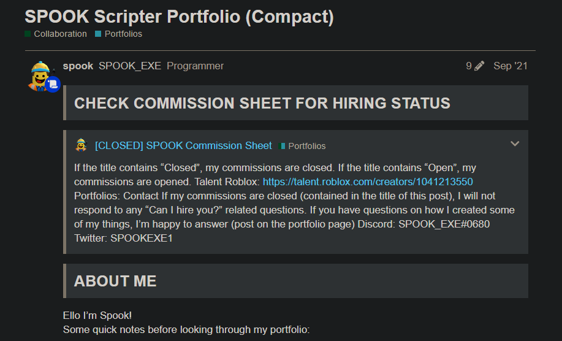
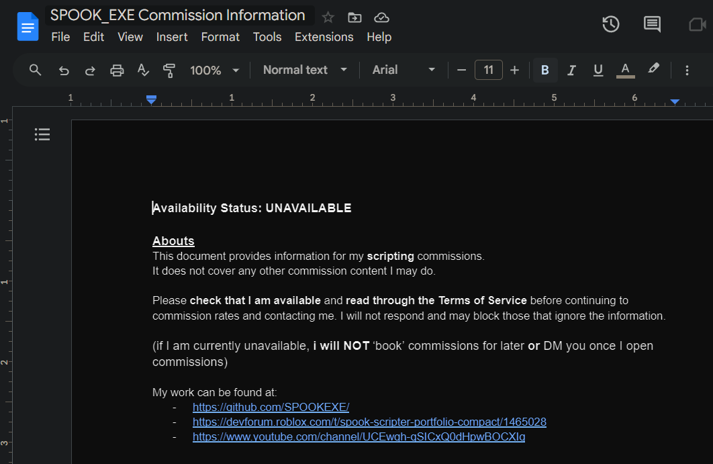

## Welcome to my GitHub!

Hey, I'm SPOOK_EXE!

I'm primarily a full-stack game developer on the ROBLOX platform, however, I have also expanded my toolset to improve my skills and knowledge across the development stack.

The majority of my programming and coding projects in my repositories are done by me.

Some areas I have explored and developed in:
- *Full-Stack Game Developer on ROBLOX*
- *Multi-Language Programming*
- *Artificial Intelligence*
- *General Tool Creation*
- *Neuroscience*
- *Hacking*
- *Automation*

*Note: The code in my repositories may not all be up-to-date and matching across the board as some projects were created before others.*

My main development tools are as listed below:

#### 🧰 Operating Systems

	
	

#### 🧰 Project Management

	
	

#### 🧰 Platforms / IDEs

	 
	
	

#### 🧰 Languages

	
	
	
	
	
	
	
	

#### 🧰 Tools

	
	
	
	
	
	
	
	

## Contact Me

Discord: **spook_exe** ( **572018169229869057** )

Discord Server: [SPOOK Games](https://discord.gg/Zx3JD7wb8X)

## Additional Links:

[Devforum Portfolio](https://devforum.roblox.com/t/spook-scripter-portfolio-compact/1465028)

[Commission Sheet](https://devforum.roblox.com/t/spook-scripter-portfolio-compact/1465028)

---

### 📺 YouTube

	
	

<!-- BEGIN YOUTUBE-CARDS -->

<!-- END YOUTUBE-CARDS -->

---

## 📊 GitHub Stats

	
	

